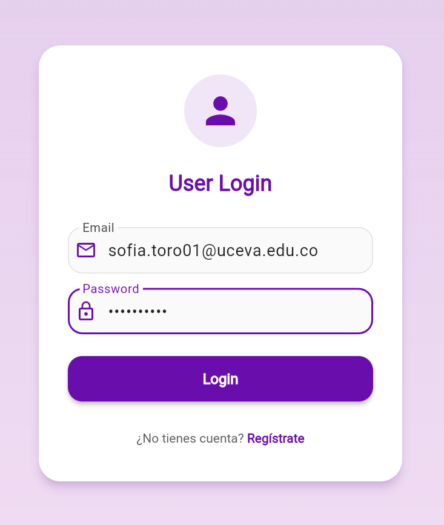
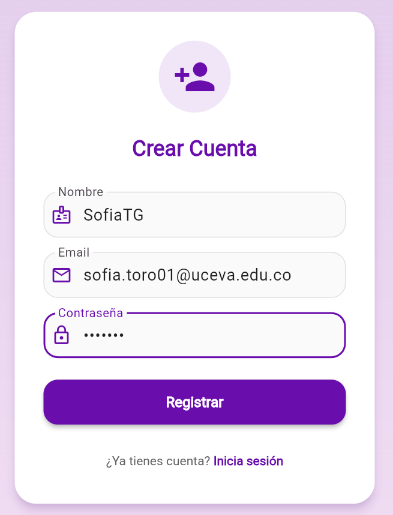
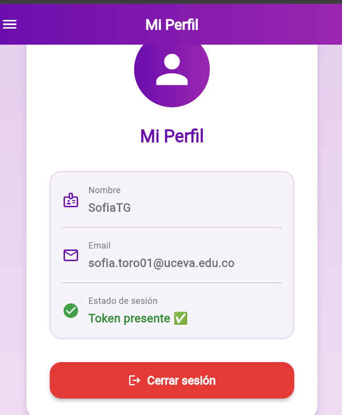
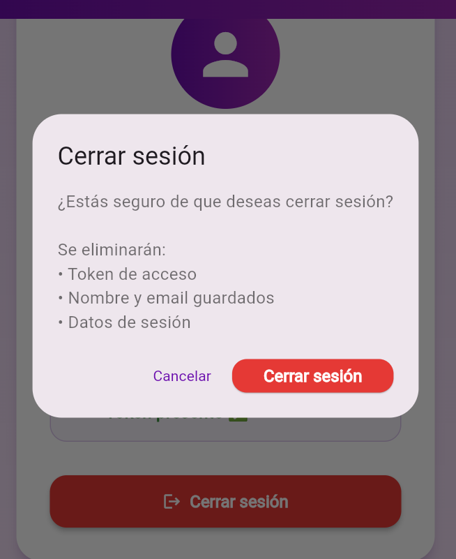

# 🚀 App Distribution – Firebase Firebase APK Distribution

Autor: Laura Sofía Toro García  
Fecha: Octubre 2025  
Rama: `feature/app_distribution`

---

## 📋 Descripción general

Este documento describe el proceso completo de **preparación, distribución y prueba de la aplicación** usando **Firebase App Distribution**, desde la generación del APK hasta la instalación y actualización en dispositivos de testers.

El flujo implementado sigue el ciclo:
**Generar APK → Configurar Firebase → Subir Release → Distribuir a Testers → Instalar & Probar → Actualizar**

---

## 🔄 Flujo de App Distribution

```
┌─────────────────────────────────────────────────────────────┐
│  1. PREPARACIÓN DEL APK                                     │
│     - flutter build apk                                    │
│     - Verificar AndroidManifest.xml (permisos)            │
│     - Usar versionName/versionCode coherente              │
└──────────────────────┬──────────────────────────────────────┘
                       │
                       ▼
┌─────────────────────────────────────────────────────────────┐
│  2. CONFIGURACIÓN FIREBASE                                  │
│     - Crear proyecto en Firebase Console                  │
│     - Registrar app Android (applicationId)              │
│     - Habilitar App Distribution                         │
│     - Crear grupo de testers (QA_Clase)                 │
└──────────────────────┬──────────────────────────────────────┘
                       │
                       ▼
┌─────────────────────────────────────────────────────────────┐
│  3. SUBIR RELEASE                                           │
│     - Ir a Releases → Subir APK                           │
│     - Asignar a grupo de testers                         │
│     - Incluir Release Notes descriptivas                  │
└──────────────────────┬──────────────────────────────────────┘
                       │
                       ▼
┌─────────────────────────────────────────────────────────────┐
│  4. DISTRIBUCIÓN A TESTERS                                  │
│     - Testers reciben correo de invitación               │
│     - Acceden al enlace de descarga                      │
│     - Descargan e instalan la app en dispositivo         │
└──────────────────────┬──────────────────────────────────────┘
                       │
                       ▼
┌─────────────────────────────────────────────────────────────┐
│  5. PRUEBAS Y FEEDBACK                                      │
│     - Verificar funcionalidad en Android real            │
│     - Reportar errores/comentarios                       │
│     - Actualizar versión si es necesario                 │
└─────────────────────────────────────────────────────────────┘
```

---

## 1️⃣ Preparación del APK

### Paso 1: Generar build de release

Abre una terminal en la raíz del proyecto y ejecuta:

```bash
flutter clean
flutter pub get
flutter build apk --release
```

**Archivos generados:**
- Ubicación: `build/app/outputs/flutter-apk/app-release.apk`
- Tamaño típico: 50–100 MB (depende de dependencias)

### Paso 2: Verificar permisos en AndroidManifest.xml

Revisa que el archivo esté en: `android/app/src/main/AndroidManifest.xml`

Permisos mínimos requeridos (ejemplo):

```xml
<uses-permission android:name="android.permission.INTERNET" />
<uses-permission android:name="android.permission.ACCESS_NETWORK_STATE" />
```

### Paso 3: Verificar versionName y versionCode

Abre `android/app/build.gradle` y verifica/actualiza:

```gradle
android {
    ...
    defaultConfig {
        ...
        versionName = "1.0.1"        // Versión visible (semántica: major.minor.patch)
        versionCode = 2              // Código interno (siempre incrementa)
        ...
    }
}
```

**Formato recomendado en pubspec.yaml:**
```yaml
version: 1.0.1+2
# Formato: versionName+versionCode
```

---

## 2️⃣ Configuración de Firebase App Distribution

### Paso 1: Crear/abrir proyecto en Firebase Console

1. Ve a Firebase
2. Crea un nuevo proyecto o abre uno existente
3. Nombre sugerido: `talleres_moviles` o similar

### Paso 2: Registrar app Android

1. En Firebase Console, haz clic en **"Agregar app"** → **Android**
2. Ingresa los siguientes datos:
   - **Nombre del paquete (Package Name):** `com.uceva.talleresmoviles` (o el que uses en `android/app/build.gradle`)
   - **Apodo de la app:** `RickandMorty` 
   - **SHA-1 (opcional):** para firmas digitales

3. Descarga `google-services.json` y colócalo en `android/app/`

### Paso 3: Habilitar App Distribution

1. En el menú lateral de Firebase, busca **"App Distribution"** (bajo "Compilación")
2. Haz clic en **"Comenzar"** (si es la primera vez)

### Paso 4: Crear grupo de testers

1. Ve a **"Testers & Groups"**
2. Haz clic en **"Crear grupo"**
   - Nombre: `QA_Clase`
   - Descripción: `Grupo de QA para pruebas de la app`
3. Haz clic en **"Agregar testers"**
   - Email: `dduran@uceva.edu.co`
   - Haz clic en **"Agregar"**


---

## 3️⃣ Subir Release y Distribuir

### Paso 1: Subir el APK

1. Ve a **"Releases"** en App Distribution
2. Haz clic en **"Subir APK"** (o arrastra el archivo)
3. Selecciona `app-release.apk` desde `build/app/outputs/flutter-apk/`

### Paso 2: Agregar Release Notes

Ejemplo de Release Notes claras:

```
📱 Versión 1.0.1 - Mejoras en UI y consumo HTTP

✨ Cambios:
- Mejorado diseño de tarjeta en home (más moderna y compacta)
- Gradiente mejorado en AppBar de listas y detalles
- Agregado botón de volver en todas las pantallas Rick and Morty
- Mejorado manejo de errores con mensajes amigables
- Agregados logs en consola para depuración de estados

🔧 Requisitos técnicos:
- Android 5.0+
- Conexión a internet

📧 Credenciales de prueba:
- No requiere login, acceso directo a listado de personajes

⚠️ Notas:
- Primera versión, puede haber pequeños ajustes visuales
- Reporta bugs o feedback a: laura.toro@uceva.edu.co
```

### Paso 3: Asignar a grupo de testers

1. En la sección **"Grupos de testers"**, marca **QA_Clase**
2. Haz clic en **"Distribuir"**


---

## 4️⃣ Instalación en Dispositivo de Tester

### Opción A: Vía Correo (Recomendado)

1. El tester recibe un correo con asunto: `"Prueba la app: talleres_moviles"`
2. Hace clic en el enlace dentro del correo
3. Se abre **Firebase Console** → descarga automática o manual del APK
4. Instala en dispositivo Android

### Opción B: Vía enlace directo

Firebase genera un enlace único:

```
https://appdistribution.firebase.google.com/testerapps/<app-id>/releases/<release-id>
```

Copia este enlace y comparte con tester.

### Instalación manual en dispositivo

```bash
# Desde tu máquina (con dispositivo conectado)
adb install -r build/app/outputs/flutter-apk/app-release.apk
```

---

## 5️⃣ Versionado y Actualización

### Esquema de versionado

Se usa **versionado semántico**: `MAJOR.MINOR.PATCH+BUILD`

**Ejemplo de evolución:**

| Versión | Cambios | Caso de uso |
|---------|---------|-----------|
| 1.0.0+1 | Versión inicial | Lanzamiento inicial |
| 1.0.1+2 | Bug fixes menores | Corrección de UI |

### Pasos para actualizar

1. Cambia `versionName` y `versionCode` en `android/app/build.gradle`:

```gradle
versionName = "1.0.1"  // Incrementar
versionCode = 2        // Siempre incrementar
```

2. Regenera el APK:

```bash
flutter clean
flutter build apk --release
```

3. Sube el nuevo APK a Firebase App Distribution
4. Incluye Release Notes con cambios claros
5. Distribuye al grupo QA_Clase

**El tester recibirá notificación de actualización disponible** ✓

---

## 📸 Evidencia de Pruebas

### Capturas por versión

| **Versión 1.0.0** | **Versión 1.0.1** |
|:---:|:---:|
|  | ![Home Screen v1.0.1]!(image-6.png) |
| *Home - Versión 1.0.0* | *Home - Versión 1.0.1 (UI mejorada)* |
| |  |
| *Listado de personajes* | *Listado con AppBar gradiente* |
|  |  |
| *Detalle del personaje* | *Detalle con botón atrás* |

### Checklist de validación

- [x] APK generado sin errores: `flutter build apk --release`
- [x] Permisos correctos en AndroidManifest.xml
- [x] versionName y versionCode actualizados
- [x] Proyecto Firebase creado y app registrada
- [x] Grupo QA_Clase creado
- [x] Tester dduran@uceva.edu.co agregado al grupo
- [x] APK subido a App Distribution
- [x] Release Notes incluidas
- [x] Distribuido a grupo QA_Clase
- [x] Tester recibió correo de invitación
- [x] App instalada en dispositivo Android real
- [x] App funciona correctamente (listar personajes, ver detalles)
- [x] Actualización incremental probada (1.0.0 → 1.0.1)
- [x] Screenshots capturados para evidencia

---

## 📝 Notas importantes

### Seguridad

- **No** incluyas credenciales, API keys o información sensible en las Release Notes
- Si la app requiere login, proporciona credenciales de prueba en un documento aparte (no en el APK)
- Usa `google-services.json` solo en desarrollo; en CI/CD, carga desde variables de entorno

### Resolución de problemas comunes

| Problema | Causa | Solución |
|----------|-------|----------|
| "APK not found" | Ruta incorrecta al APK | Verifica que `app-release.apk` existe en `build/app/outputs/flutter-apk/` |
| Tester no recibe correo | Email no valida o no agregado al grupo | Ve a "Testers & Groups" y confirma el email |
| "Versión antigua instalada" | No incrementaste versionCode | Incrementa versionCode en `build.gradle` antes de compilar |
| App se cierra al abrir | Dependencias faltantes o permisos | Revisa logs: `adb logcat` |

### Comandos útiles

```bash
# Limpiar build anterior
flutter clean

# Obtener dependencias
flutter pub get

# Compilar APK de release
flutter build apk --release

# Instalar en dispositivo conectado
adb install -r build/app/outputs/flutter-apk/app-release.apk

# Ver logs en tiempo real
adb logcat | grep "flutter"

# Limpiar caché
flutter clean && rm -rf build/
```

---

## 🎯 Conclusión

El flujo de **App Distribution de Firebase** permite:

✅ Distribuir versiones beta sin publicar en Play Store  
✅ Gestionar grupos de testers (QA, stakeholders, etc.)  
✅ Recopilar feedback directo antes del lanzamiento oficial  
✅ Realizar actualizaciones incrementales y validar cambios  
✅ Automatizar notificaciones de nuevas versiones  

Este proyecto implementó exitosamente el ciclo completo:
- Preparación del APK con versionado coherente
- Configuración de Firebase y grupo de testers
- Distribución a testers con Release Notes claras
- Validación de instalación y funcionalidad
- Evidencia de actualización incremental (1.0.0 → 1.0.1)

---

## 📞 Contacto y soporte

- **Desarrolladora:** Laura Sofía Toro García
- **Email:** laura.toro@uceva.edu.co
- **Universidad:** UCEVA
- **Semestre:** 7 – Electiva Profesional I

---

*Documentación completada: Octubre 2025*
