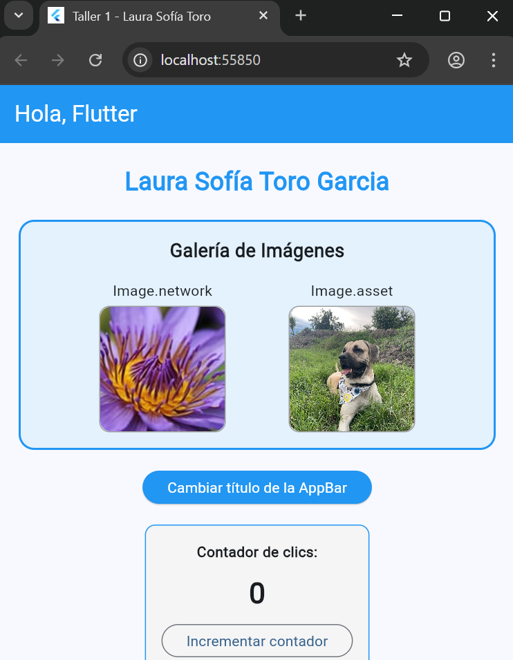
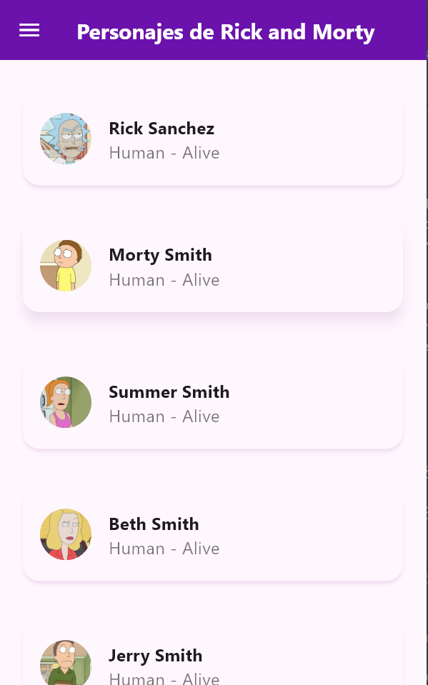
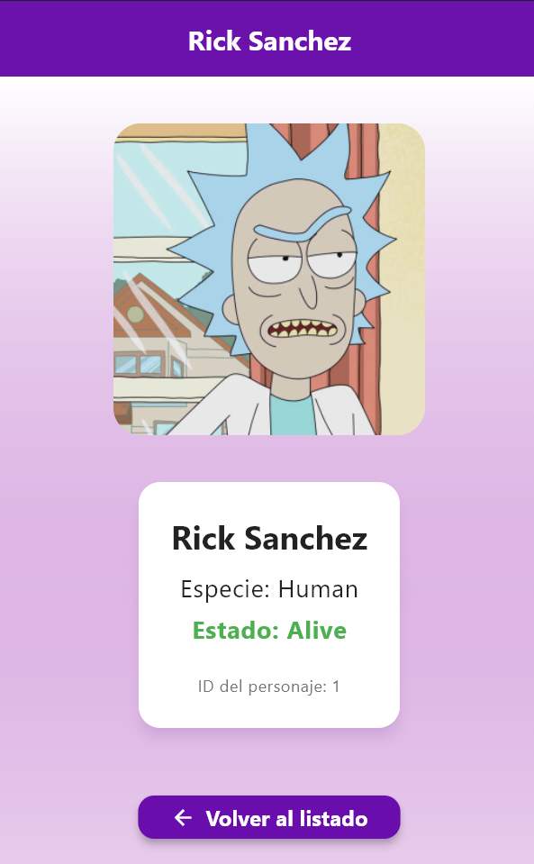
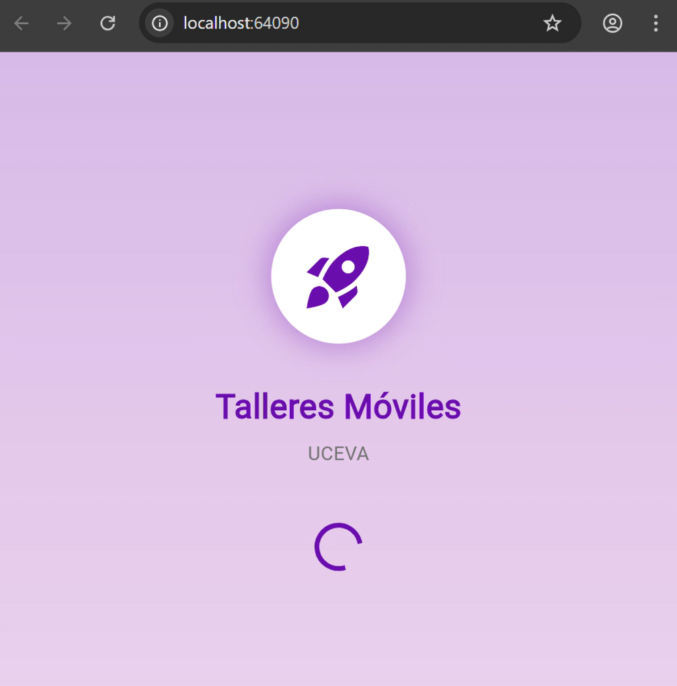
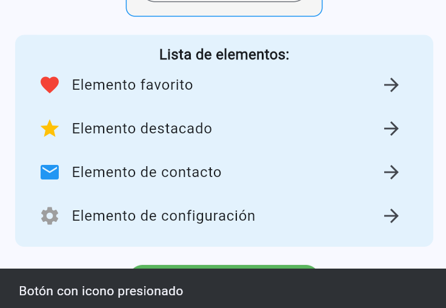

# talleres_moviles
# Taller Flutter - Widgets Básicos

## Descripción
Aplicación Flutter desarrollada como taller práctico que demuestra el uso de widgets básicos y gestión de estado con 'setState()'. La aplicación incluye una interfaz con múltiples componentes interactivos que cumplen con los requisitos solicitados.

## Datos del Estudiante
- **Nombre:** Laura Sofía Toro Garcia
- **Código:** [230222021]

## Pasos para ejecutar
1. Clonar o descargar el proyecto
2. Ejecutar 'flutter pub get' para obtener dependencias
3. Configurar el emulador, en mi caso no utilice emulador ya que tengo recursos limitados con mi pc.
4. Ejecutar 'flutter run' para iniciar la aplicación

## Capturas de la aplicación
- **Estado inicial de la app:** Al iniciar la aplicación, se visualiza una interfaz con un AppBar que muestra el título "Hola, Flutter" en color blanco sobre fondo azul, seguido del nombre "Laura Sofía Toro Garcia" en azul y negrita, una galería con dos imágenes (una cargada desde internet y otra desde assets locales) dentro de Containers decorativos con bordes y esquinas redondeadas, un botón azul para cambiar el título, un contador inicializado en cero con su botón de incremento, una ListView con cuatro elementos con iconos descriptivos, y finalmente un ElevatedButton con icono de añadir.

- **Estado tras presionar el botón:** Al presionar el botón "Cambiar título de la AppBar", el título de la AppBar alterna entre "Hola, Flutter" y "¡Título cambiado!", mostrando simultáneamente un SnackBar en la parte inferior con el mensaje "Título actualizado" que permanece visible durante 1 segundo.

- **Funcionamiento de los widgets adicionales:**
- **Container decorativo:** Se utilizó para enmarcar las imágenes con bordes grises y esquinas redondeadas de 10px, mejorando la presentación visual.
- **ListView:** Implementa una lista de cuatro elementos (favorito, destacado, contacto y configuración) con iconos temáticos y flechas indicadoras en cada ListTile.
- **OutlinedButton:** Utilizado para el contador, permite incrementar el valor numérico con cada pulsación.
- **ElevatedButton.icon:** Botón con icono de añadir que muestra un SnackBar con el mensaje "Botón con icono presionado" durante 1 segundo al ser presionado.

# Taller2

## Datos del Estudiante
- **Nombre:** Laura Sofía Toro Garcia
- **Código:** [230222021]

Este taller lo realicé siguiendo el ejemplo visto en clase sobre navegación y paso de parámetros con go_router, adaptando la estructura y los widgets para cumplir los requisitos y mejorar la experiencia de usuario. Me apoyé en las explicaciones del docente y la documentación oficial de Flutter para asegurar buenas prácticas en la arquitectura y el manejo de rutas.

# Arquitectura y navegación
La aplicación utiliza go_router para gestionar las rutas y la navegación entre pantallas. Se definieron las siguientes rutas principales:

- **Ruta raíz:** carga el TabBar con las tres secciones principales (Home, Parámetros y Ciclo de Vida).

- **Ruta de detalle:** recibe parámetros enviados desde la pantalla Home y muestra el método de navegación utilizado.

- **Ruta de ciclo de vida:** Permite observar la ejecución de los principales métodos del ciclo de vida de un StatefulWidget.

# Métodos de navegación implementados:

go() → reemplaza toda la pila de navegación (no se puede regresar con el botón de retroceso).

push() → apila una nueva pantalla sobre la actual (permite regresar).

replace() → sustituye la pantalla actual (se puede volver, pero sin conservar la reemplazada).

Cada navegación envía un parámetro que se recibe en la pantalla de detalle, mostrando al usuario qué valor se pasó y qué comportamiento tuvo según el método de navegación.

# Widgets Usados y Justificación

- **GridView:** organiza elementos en cuadrícula en la pantalla Home. Es ideal para mostrar varias opciones de navegación de forma visual y ordenada.

- **TabBar y TabBarView:** permiten estructurar la app en tres secciones principales, facilitando un flujo claro sin necesidad de abrir nuevas pantallas.

- **FloatingActionButton + SnackBar:** en la sección de Parámetros, el FAB limpia el campo de texto y el SnackBar confirma la acción, mejorando la experiencia de usuario.

- **Drawer (Menú lateral personalizado):** ofrece otra forma de navegación rápida hacia las secciones principales.

- **Hero Animation:** aporta dinamismo al transformar una tarjeta del Home en el título de la pantalla de detalle mediante animación.

# Ciclo de Vida (StatefulWidget)

En la pantalla de Ciclo de Vida se evidencian los principales métodos:
- **initState():** inicialización del widget.
- didChangeDependencies(): se ejecuta al cambiar dependencias del contexto.
build(): construye la interfaz y se actualiza en cada setState().
setState(): notifica cambios y reconstruye la UI.
dispose(): se ejecuta al destruir el widget.
# Esto permite visualizar en consola la secuencia real del ciclo de vida:

initState() → didChangeDependencies() → build() (entrada)
setState() → build() (interacciones)
dispose() (salida)