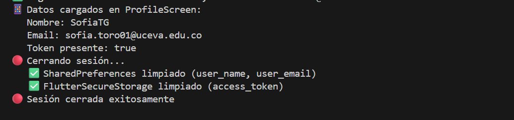

# Taller Autenticación JWT y Almacenamiento Seguro

**Autor:** Laura Sofía Toro García  
**Fecha:** Octubre 2025  
**Rama:** `feature/taller_jwt`

---

## 📘 Descripción General

Este proyecto implementa un **sistema completo de autenticación JWT** consumiendo una API REST externa (`https://parking.visiontic.com.co`), con almacenamiento seguro de credenciales y gestión de sesión persistente usando Flutter.

### 🎯 Objetivos Cumplidos

✅ **Consumo de API REST con autenticación**  
✅ **Registro de usuarios** (POST `/api/users`)  
✅ **Login con credenciales** (POST `/api/login`)  
✅ **Almacenamiento diferenciado:**
- `shared_preferences`: datos NO sensibles (nombre, email)
- `flutter_secure_storage`: datos sensibles (token JWT)

✅ **Pantalla de perfil** con evidencia de datos almacenados  
✅ **Guards de navegación** (protección de rutas autenticadas)  
✅ **Splash screen** con verificación automática de sesión  
✅ **Logout completo** con limpieza de datos  

---

## 🏗️ Arquitectura del Proyecto

```
lib/
├── main.dart                         # Punto de entrada con Provider
│
├── routes/
│   └── app_router.dart              # Rutas con guards de autenticación
│
├── models/
│   └── auth_models.dart             # LoginRequest, RegisterRequest, User
│
├── services/
│   ├── auth_service.dart            # Lógica de autenticación y HTTP
│   └── storage_service.dart         # Gestión de almacenamiento local
│
├── view/
│   ├── auth/
│   │   ├── splash_screen.dart       # Verificación inicial de sesión
│   │   ├── login_screen.dart        # Pantalla de inicio de sesión
│   │   └── register_screen.dart     # Pantalla de registro
│   │
│   ├── profile/
│   │   └── profile_screen.dart      # Evidencia de almacenamiento
│   │
│   └── home/
│       └── home_screen.dart         # Pantalla principal
│
├── widgets/
│   └── custom_drawer.dart           # Menú lateral de navegación
│
└── themes/
    └── app_theme.dart               # Tema morado corporativo
```

---

## 🌐 API Consumida

### **Base URL**
```
https://parking.visiontic.com.co/api
```

### **Endpoints Implementados**

#### 1️⃣ **Registro de Usuario**
```http
POST /api/users
Content-Type: application/json

{
  "name": "SofiaTG",
  "email": "sofia.toro01@uceva.edu.co",
  "password": "password123"
}
```

**Respuesta exitosa (201):**
```json
{
  "success": true,
  "message": "Usuario creado correctamente",
  "data": {
    "id": 39,
    "name": "SofiaTG",
    "email": "sofia.toro01@uceva.edu.co",
    "created_at": "2025-10-28T23:23:13.000000Z",
    "updated_at": "2025-10-28T23:23:13.000000Z"
  }
}
```

---

#### 2️⃣ **Login (Autenticación)**
```http
POST /api/login
Content-Type: application/json

{
  "email": "sofia.toro01@uceva.edu.co",
  "password": "password123"
}
```

**Respuesta exitosa (200):**
```json
{
  "success": true,
  "token": "eyJ0eXAiOiJKV1QiLCJhbGciOiJIUzI1NiJ9...",
  "user": {
    "id": 39,
    "name": "SofiaTG",
    "email": "sofia.toro01@uceva.edu.co"
  }
}
```

---

## 💾 Almacenamiento de Datos

### **Estrategia de Seguridad Implementada**

| Tipo de Dato | Almacenamiento | Motivo |
|--------------|----------------|--------|
| **Token JWT** | `flutter_secure_storage` | ✅ Sensible - Requiere encriptación |
| **Nombre del usuario** | `shared_preferences` | ⚪ No sensible - Dato público |
| **Email del usuario** | `shared_preferences` | ⚪ No sensible - Identificador público |

### **Implementación en Código**

#### **Al hacer Login (`auth_service.dart`):**
```dart
// 1. Guardar token en almacenamiento SEGURO
await storage.write(key: 'access_token', value: token);

// 2. Guardar datos NO sensibles en SharedPreferences
final prefs = await SharedPreferences.getInstance();
await prefs.setString('user_name', user.name);
await prefs.setString('user_email', user.email);
```

#### **Al hacer Logout:**
```dart
// Limpiar SharedPreferences
final prefs = await SharedPreferences.getInstance();
await prefs.clear();  // Elimina: user_name, user_email

// Limpiar FlutterSecureStorage
await storage.deleteAll();  // Elimina: access_token
```

---

## 🔒 Sistema de Navegación y Guards

### **Flujo de Autenticación**

```
App Inicia
    ↓
SplashScreen (/)
    ↓
¿Existe token en secure_storage?
    ├─ SÍ → HomeScreen (/home)
    └─ NO → LoginScreen (/login)
         ↓
    Usuario se autentica
         ↓
    ProfileScreen (/profile) ✅
```

### **Guard de Rutas (`app_router.dart`)**

```dart
redirect: (context, state) async {
  final storage = StorageService();
  final token = await storage.getToken();
  final isAuthenticated = token != null;

  // Proteger /profile
  if (state.matchedLocation == '/profile' && !isAuthenticated) {
    print('🔒 Acceso denegado - Redirigiendo a /login');
    return '/login';
  }

  return null;
},
```

**Rutas protegidas:**
- `/profile` → Requiere token válido

**Rutas públicas:**
- `/login`, `/register`, `/home`

---

## 📱 Pantallas Implementadas

### **1. Splash Screen (Verificación Automática)**

**Ubicación:** `lib/view/auth/splash_screen.dart`

**Funcionalidad:**
- ✅ Verifica si existe token en `flutter_secure_storage`
- ✅ Si hay token → redirige a `/home`
- ✅ Si NO hay token → redirige a `/login`
- ✅ Muestra logo corporativo y loading

**Captura:**

| Splash Screen |
|:---:|
|  |

---

### **2. Login Screen**

**Ubicación:** `lib/view/auth/login_screen.dart`

**Características:**
- ✅ Card centrada con diseño moderno
- ✅ Campos: Email, Password
- ✅ Validación de credenciales
- ✅ Manejo de errores con mensajes claros
- ✅ Redirección automática a `/profile` tras login exitoso
- ✅ Enlace a registro

**Logs de consola esperados:**
```
🔵 Intentando login a: https://parking.visiontic.com.co/api/login
🔵 Respuesta del servidor - Status: 200
🔵 Datos recibidos: {success: true, token: eyJ0..., user: {...}}
✅ Login exitoso - Usuario: SofiaTG, Email: sofia.toro01@uceva.edu.co
```

**Capturas:**

| Login Screen |Logs Login Screen |
|:---:|:---:|
|||

---

### **3. Register Screen**

**Ubicación:** `lib/view/auth/register_screen.dart`

**Características:**
- ✅ Card centrada con diseño moderno
- ✅ Campos: Nombre, Email, Password
- ✅ Validación de campos
- ✅ Manejo de errores (email duplicado, etc.)
- ✅ Redirección automática a `/login` tras registro exitoso
- ✅ Enlace a login

**Logs de consola esperados:**
```
🟣 Intentando registro a: https://parking.visiontic.com.co/api/users
🟣 Respuesta del servidor - Status: 201
✅ Registro exitoso
```

**Capturas:**

|Register Screen|Logs Register Screen | 
|:---:|:---:|
| ||

---

### **4. Profile Screen (Evidencia de Almacenamiento)**

**Ubicación:** `lib/view/profile/profile_screen.dart`

**Funcionalidad:**
- ✅ Muestra datos del usuario desde `shared_preferences`:
  - Nombre
  - Email
- ✅ Muestra estado del token desde `flutter_secure_storage`:
  - ✅ "Token presente" (verde) si existe
  - ❌ "Sin token" (rojo) si no existe
- ✅ Botón "Cerrar sesión" con diálogo de confirmación
- ✅ Drawer de navegación disponible

**Logs de consola esperados:**
```
📱 Datos cargados en ProfileScreen:
   Nombre: Laura Sofía
   Email: sofia.toro01@uceva.edu.co
   Token presente: true
```

**Al cerrar sesión:**
```
🔴 Cerrando sesión...
   ✅ SharedPreferences limpiado (user_name, user_email)
   ✅ FlutterSecureStorage limpiado (access_token)
🔴 Sesión cerrada exitosamente
```

**Capturas:**

| Profile | Cerrar Sesión | Logs Sesión - Sesión Cerrada | 
|:---:|:---:|:---:|
| |||

---

## 🎨 Diseño y UX

### **Tema Visual**

- **Colores principales:**
  - Primary: `#6A0DAD` (Morado oscuro)
  - Secondary: `#9C27B0` (Morado intermedio)
  - Accent: `#E1BEE7` (Lavanda)

- **Componentes:**
  - Cards con sombras y bordes redondeados (24px)
  - Gradientes sutiles en fondos
  - Icons circulares con gradiente
  - Botones con elevación y transiciones

### **Consistencia Visual**

✅ AppBar con gradiente en todas las pantallas autenticadas  
✅ Cards centradas con diseño moderno  
✅ TextField con bordes redondeados y focus states  
✅ Botones de ancho completo con íconos  
✅ Diálogos de confirmación con acciones claras  

---

## 🛠️ Tecnologías y Paquetes

### **Dependencias Principales**

```yaml
dependencies:
  flutter:
    sdk: flutter
  
  # Navegación
  go_router: ^16.2.4
  
  # HTTP
  http: ^1.5.0
  
  # Almacenamiento
  shared_preferences: ^2.2.2      # NO sensible
  flutter_secure_storage: ^9.0.0  # Sensible (tokens)
  
  # State Management
  provider: ^6.1.1
  
  # Utilidades
  flutter_dotenv: ^5.1.0
```

---

## 🚀 Cómo Ejecutar el Proyecto

### **Requisitos Previos**
- Flutter SDK 3.x
- Dart 3.x
- Conexión a internet

### **Instalación**

1. **Clonar el repositorio y cambiar a la rama:**
```bash
git clone https://github.com/SofiaToro018/talleres_moviles.git
cd talleres_moviles
git checkout feature/taller_jwt
```

2. **Instalar dependencias:**
```bash
flutter pub get
```

3. **Ejecutar en Web (con solución CORS para desarrollo):**
```bash
flutter run -d chrome --web-browser-flag "--disable-web-security" --web-browser-flag "--user-data-dir=C:\temp\chrome_dev"
```

4. **O ejecutar en Android (sin problemas de CORS):**
```bash
flutter run
# Seleccionar dispositivo Android conectado
```

---

## 🧪 Flujo de Pruebas

### **Caso 1: Registro y Login**
1. Abrir la app → ver Splash → redirigir a Login
2. Ir a Registro
3. Ingresar datos: nombre, email, password
4. Verificar registro exitoso → redirigir a Login
5. Ingresar credenciales
6. Verificar login exitoso → redirigir a Profile
7. Ver datos en Profile (nombre, email, token ✅)

### **Caso 2: Persistencia de Sesión**
1. Hacer login
2. Cerrar la app completamente
3. Abrir la app nuevamente
4. Verificar que abre directamente en Home (sesión persistente)

### **Caso 3: Protección de Rutas**
1. Sin hacer login, intentar navegar a `/profile` desde URL
2. Verificar redirección automática a `/login`
3. Ver log en consola: `🔒 Acceso denegado`

### **Caso 4: Logout Completo**
1. Desde Profile, clic en "Cerrar sesión"
2. Confirmar en diálogo
3. Verificar logs de limpieza en consola
4. Verificar redirección a Login
5. Intentar volver a Profile → debe redirigir a Login

---

## 🔍 Detalles Técnicos de Implementación

### **1. Manejo de Errores HTTP**

```dart
try {
  final response = await http.post(
    Uri.parse(loginEndpoint),
    headers: {'Content-Type': 'application/json'},
    body: jsonEncode(request.toJson()),
  ).timeout(const Duration(seconds: 15));

  if (response.statusCode == 200) {
    // Procesar respuesta exitosa
  } else {
    // Manejar errores del servidor
  }
} on http.ClientException catch (e) {
  // Error de conexión
} catch (e) {
  // Error inesperado
}
```

### **2. State Management con Provider**

```dart
// En main.dart
MultiProvider(
  providers: [
    ChangeNotifierProvider(create: (_) => AuthService())
  ],
  child: const MyApp(),
)

// En las pantallas
final authService = Provider.of<AuthService>(context);
```

### **3. Lectura de Datos Almacenados**

```dart
// Desde shared_preferences
final prefs = await SharedPreferences.getInstance();
final name = prefs.getString('user_name');
final email = prefs.getString('user_email');

// Desde flutter_secure_storage
final token = await storage.read(key: 'access_token');
```

---

## 📊 Comparativa: Antes vs Después

| Aspecto | Antes (rama main) | Después (feature/taller_jwt) |
|---------|-------------------|------------------------------|
| Autenticación | ❌ No implementada | ✅ JWT completo |
| Almacenamiento seguro | ❌ No existe | ✅ Diferenciado (secure/shared) |
| Guards de rutas | ❌ No protegidas | ✅ Rutas protegidas |
| Splash screen | ❌ No existe | ✅ Con verificación de sesión |
| Persistencia de sesión | ❌ No existe | ✅ Automática |
| Logout | ❌ No existe | ✅ Con limpieza completa |

---

## 🐛 Resolución de Problemas Comunes

### **Problema: CORS en Web**
**Solución:** Usar el comando con flags de Chrome o ejecutar en Android.

### **Problema: "No se puede conectar al servidor"**
**Solución:** Verificar:
1. Conexión a internet
2. Permisos en AndroidManifest.xml
3. Servidor está disponible: `curl https://parking.visiontic.com.co/api/users`

### **Problema: Datos no aparecen en Profile**
**Solución:** Verificar logs en consola:
- ¿Login fue exitoso?
- ¿Se guardaron los datos?
- ¿Profile está leyendo las claves correctas?

---

## 📚 Recursos Adicionales

- [Documentación oficial de go_router](https://pub.dev/packages/go_router)
- [Flutter Secure Storage](https://pub.dev/packages/flutter_secure_storage)
- [Shared Preferences](https://pub.dev/packages/shared_preferences)
- [HTTP Package](https://pub.dev/packages/http)

---

## ✅ Checklist de Cumplimiento

- [x] Consumo de API REST con POST requests
- [x] Registro de usuarios funcional
- [x] Login con credenciales
- [x] Almacenamiento diferenciado (secure vs shared)
- [x] Token JWT guardado de forma segura
- [x] Datos NO sensibles en shared_preferences
- [x] Pantalla de perfil con evidencia de almacenamiento
- [x] Estado de sesión visible (token presente/ausente)
- [x] Botón de logout funcional
- [x] Limpieza completa de datos al cerrar sesión
- [x] Guards de navegación (protección de rutas)
- [x] Splash screen con verificación de sesión
- [x] Redirección automática según autenticación
- [x] Manejo de errores HTTP con mensajes claros
- [x] Logs detallados en consola para debugging
- [x] Diseño moderno y consistente
- [x] Drawer de navegación en todas las pantallas autenticadas

---

## 👥 Autor

**Laura Sofía Toro García**  
Universidad: UCEVA  
Semestre: 7 – Electiva Profesional I  
Email: laura.toro@uceva.edu.co

---

*Documentación completada: Octubre 2025*


