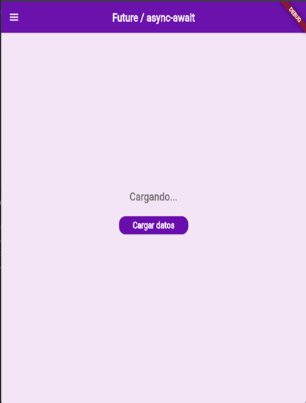
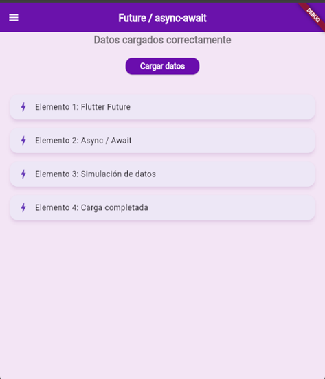
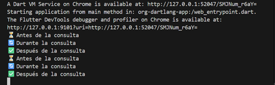
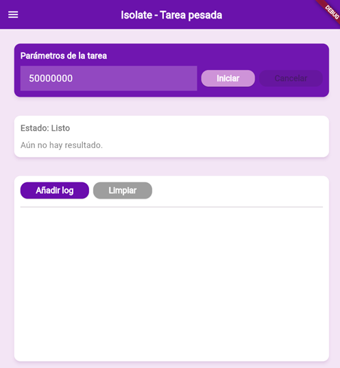
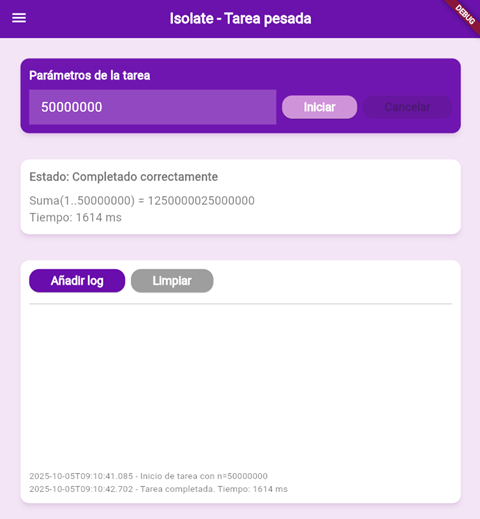
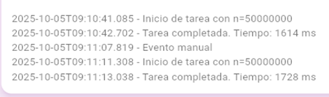
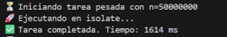

# 🟣 README – Taller Flutter (Future, Timer e Isolate)
#Laura Sofia Toro Garcia
#230222021

## 📘 Descripción general  

Este proyecto implementa tres funcionalidades principales en Flutter:

- **Future / async-await** para manejar operaciones asíncronas sin bloquear la UI.  
- **Cronómetro (Timer)** con control de tiempo en vivo.  
- **Tarea pesada (Isolate)** ejecutada en segundo plano sin afectar el rendimiento de la aplicación.  

Todas las vistas comparten un **diseño moderno con tema morado degradado**, coherente en toda la aplicación, y una **navegación lateral** implementada mediante un **Drawer personalizado**.

---

## 🎯 Objetivo  

**Desarrollar una aplicación en Flutter** que demuestre la asincronía utilizando:  

- `Future` y `async/await` para operaciones no bloqueantes,  
- `Timer` para control del tiempo (cronómetro o cuenta regresiva), y  
- `Isolate` (o `compute()`) para ejecutar tareas pesadas en segundo plano.  

El propósito es entender cómo Flutter maneja tareas **asíncronas y paralelas** sin bloquear la interfaz del usuario, manteniendo siempre un diseño fluido, limpio y moderno.

---

## ⚙️ Estructura general  

| Pantalla | Descripción |
|-----------|--------------|
| **Future** | Simula una carga asíncrona de datos con `Future.delayed` y muestra el resultado al usuario. |
| **Cronómetro (Timer)** | Permite iniciar, pausar, reanudar y reiniciar el tiempo, actualizando la UI cada 100 ms. |
| **Tarea pesada (Isolate)** | Ejecuta una suma intensiva (1..n) sin bloquear la UI principal. Usa `Isolate.spawn` o `compute()` según la plataforma. |
| **Menú lateral (CustomDrawer)** | Permite navegar entre las pantallas principales del proyecto. |

---

## 📁 Organización de carpetas  
```
lib/
│
├── main.dart
│
├── themes/
│ └── app_themes.dart # Tema general con tonos morados y degradados
│
├── views/
│ ├── future_view.dart # Demostración de Future / async-await
│ ├── timer_view.dart # Cronómetro usando Timer
│ └── isolate_view.dart # Tarea pesada usando Isolate / compute
│
└── widgets/
└── custom_drawer.dart # Menú lateral común a todas las pantallas
```

---

## ⏳ 1. Future y async/await  

**Archivo:** `future_view.dart`

### 🔧 Lógica usada

- Usa un `Future` para simular una tarea asíncrona (como una petición a un servidor).  
- `async/await` permite esperar el resultado sin congelar la interfaz.  
- Muestra el estado del proceso: “Cargando…”, “Completado” o “Error”.  

### ⚙️ Ejemplo:
```dart
Future<String> _fakeFetchData() async {
  await Future.delayed(const Duration(seconds: 3));
  return "Datos cargados correctamente";
}

void _loadData() async {
  setState(() => _status = "Cargando...");
  final result = await _fakeFetchData();
  setState(() => _status = result);
}
```
# 🎨 Interfaz

- Texto central con el estado actual.
- Botón “Cargar datos”.
- Fondo degradado morado coherente con el tema general.


### ** Resultado Future / async / await - Carga Asíncrona de Datos**

| Estado inicial | Durante la carga | Datos cargados | Logs de consola |
|:---:|:---:|:---:|:---:|
| |  |  |  |
| **⏳ Estado inicial** | **🔄 Durante la carga** | **✅ Datos cargados** | **📊 Logs de consola** |

# 💡 Cuándo usar Future
- Consultas a APIs.
- Operaciones de red o base de datos.
- Simulación de procesos o retardos controlados.


---

## 🕒 2. Cronómetro (uso de Timer)

**Archivo:** `timer_view.dart`

### 🔧 Lógica usada:

- Se utiliza la clase `Timer` de Dart para actualizar el tiempo cada 100 ms.
- Cuando el usuario presiona **Iniciar**, se activa el contador.
- **Pausar** detiene el Timer (cancelando la instancia actual).
- **Reanudar** crea un nuevo Timer desde el valor previo.
- **Reiniciar** pone el tiempo en cero.

#### 🔁 Ciclo de actualización:
```dart
_timer = Timer.periodic(Duration(milliseconds: 100), (timer) {
  setState(() {
    _milliseconds += 100;
  });
});
```

### 🎨 Interfaz:

- Tiempo grande en el centro (MM:SS:CS).
- Botones redondeados (**Iniciar**, **Pausar**, **Reanudar**, **Reiniciar**).
- Fondo con degradado morado.
- Estado visible (“DETENIDO”, “EN MARCHA”, etc.).

### ** Resultado Timer Cronómetro**

| Iniciar Crónometro | Pausa | Reanudar | Reiniciar | Logs de consola |
|:---:|:---:|:---:|:---:|:---:|
|  |  |  |  | |
| **⏱️ Iniciar Crónometro** |**⏸️  Pausado** | **▶️ Reanudar** | **🔄 Reiniciar** |  **📊 Logs de consola** |

Usa `Timer` cuando necesites actualizar la UI periódicamente o ejecutar tareas a intervalos regulares, como:

- Cronómetros o temporizadores.
- Animaciones simples.
- Recordatorios cortos o tareas programadas.

---

## 🧠 3. Tarea Pesada (uso de Isolate / compute())

**Archivo:** `isolate_view.dart`

### 🔧 Lógica usada:

- Permite ingresar un número n (ejemplo: 50,000,000).
- Ejecuta la función `heavySumTask(n)` que calcula la suma de 1 hasta n.
- Para no bloquear la UI:
  - En móviles o escritorio: usa `Isolate.spawn()`.
  - En Flutter Web: usa `compute()`.

#### ⚙️ Ejemplo:
```dart
final result = await compute(heavySumTask, input);
```

#### 🧩 Función pesada:
```dart
Future<Map<String, dynamic>> heavySumTask(int n) async {
  var sum = 0;
  for (var i = 1; i <= n; i++) sum += i;
  return {'n': n, 'sum': sum};
}
```

### 🎨 Interfaz:

- Campo de entrada para n.
- Botones: Iniciar / Cancelar.
- Muestra el estado actual: Listo, Ejecutando, Completado, Error.
- Incluye consola interactiva para logs.

### 🧠 Isolate - Procesamiento Pesado Sin Bloquear UI**

| Estado Inicial | Procesamiento en Isolate | Logs en Consola |
|:---:|:---:|:---:|
|  |  |  | |
| **🔧 Listo para procesar** | **⚙️ Análisis de  datos** | **📊 Logs de Isolate** |**📊 Logs de Consola** |

### 💡 Cuándo usar Isolate:

Usa `Isolate` o `compute()` cuando tengas tareas CPU-bound que puedan bloquear la interfaz, como:

- Procesamientos matemáticos extensos.
- Análisis o conversión de datos pesados.
- Procesamiento de imágenes o archivos grandes.

## ✅ Conclusión

Este taller permitió comprender en profundidad cómo Flutter maneja la **asincronía y la ejecución en segundo plano**, dos aspectos esenciales para desarrollar aplicaciones móviles modernas, reactivas y eficientes.  
A través de la implementación práctica de **Future**, **async/await**, **Timer** e **Isolate**, se demostró cómo es posible ejecutar tareas de distinta naturaleza sin bloquear la interfaz del usuario.

En primer lugar, el uso de **Future y async/await** facilitó la gestión de operaciones asíncronas como simulaciones de carga de datos o tareas que requieren esperar una respuesta. Esto permitió evidenciar cómo Flutter puede continuar respondiendo a las interacciones del usuario mientras se completan procesos en segundo plano, manteniendo una experiencia fluida y sin interrupciones.

Posteriormente, con el uso del **Timer**, se desarrolló un cronómetro totalmente funcional con opciones de iniciar, pausar, reanudar y reiniciar el conteo del tiempo. Esta implementación demostró cómo controlar procesos repetitivos o de actualización constante en intervalos definidos, aplicando la función `Timer.periodic()` para mantener el flujo de información sincronizado con la UI en tiempo real.

Finalmente, la parte del **Isolate (o compute())** permitió abordar el concepto de tareas **CPU-bound**, es decir, aquellas que requieren alto procesamiento. Se implementó un proceso pesado (una suma masiva) ejecutado en un hilo independiente, garantizando que la interfaz no se congelara ni perdiera rendimiento durante su ejecución. Esto reforzó el entendimiento sobre cómo Flutter maneja la **paralelización y la comunicación entre hilos** mediante el uso de mensajes.

En conjunto, los resultados obtenidos cumplen con todos los objetivos del ejercicio:  
- Se implementaron correctamente los mecanismos de asincronía de Flutter.  
- Se garantizó una experiencia de usuario fluida sin bloqueos de la UI.  
- Se comprendió cómo distribuir las cargas de trabajo entre tareas ligeras y pesadas.  

En conclusión, este proyecto sirvió para consolidar la comprensión de los **principios fundamentales de concurrencia, asincronía y ejecución en segundo plano en Flutter**, habilidades clave para crear aplicaciones escalables, reactivas y optimizadas en entornos reales de desarrollo.


