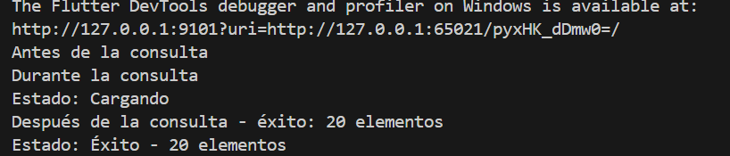

# 🟣 README – Taller manejo de api (HTTP)

Autor: Laura Sofía Toro García

## 📘 Descripción general

- Desarrollar un módulo que consuma datos desde una API pública usando el paquete http, mostrando un listado y una pantalla de detalle con navegación via go_router. El foco es implementar un flujo robusto de consumo HTTP que cubra estados de carga/éxito/error, un manejo de errores claro y buena separación de responsabilidades mediante una capa de servicios/repositorios y modelos tipados.

- Integración HTTP con una API pública (Rick and Morty) para listar y ver detalles de personajes.

- El proyecto usa `go_router` para la navegación y un tema morado degradado coherente en todas las pantallas.

---

## 🏁 Cómo ejecutar (rápido)

1. Asegúrate de tener Flutter instalado (compatible con tu plataforma).
2. Copia el archivo `.env.example` a `.env` y ajusta la variable `API_BASE_URL` si es necesario.
3. Ejecuta:

```bash
flutter pub get
flutter run
```

---

### 🏗️ Arquitectura (carpetas relevantes)

```
lib/
├── main.dart
│
├── routes/
│   └── app_router.dart         # Definición de todas las rutas con go_router
│
├── themes/
│   └── app_theme.dart          # Colores, estilos, etc.
│
├── models/
│   └── character_model.dart    # Modelo del personaje
│
├── services/
│   └── character_service.dart  # Servicio HTTP para consumir la API
│
├── view/
│   ├── home/
│   │   └── home_screen.dart    # Pantalla principal (botón para ir al listado)
│   │
│   ├── rickandmorty/           # Nuevo módulo (carpeta separada)
│   │   ├── list_screen.dart    # Pantalla con el ListView de personajes
│   │   └── detail_screen.dart  # Pantalla con detalle del personaje
│   │
│   ├── ciclo_vida/
│   ├── future/
│   ├── isolate/
│   ├── paso_parametros/
│   └── timer/
│
└── ...
```
---

### 🔍 API usada

```
API_BASE_URL=https://rickandmortyapi.com/api
```
---
- Endpoint principal: `GET https://rickandmortyapi.com/api/character` esta api es basicamente personajes de una serie en la cual se muestra el id, nombre, estado, especie e imagen en la cual redirege estos datos.

### Documentación:
[text](https://rickandmortyapi.com/documentation/)

- Ejemplo de respuesta (resumida):

```json
{
	"info": {"count": 826, "pages": 42, "next": "...", "prev": null},
	"results": [
		{
			"id": 1,
			"name": "Rick Sanchez",
			"status": "Alive",
			"species": "Human",
			"gender": "Male",
			"image": "https://.../rick.png",
			
		}
	]
}
```

En el proyecto la URL base se gestiona desde `.env` como `API_BASE_URL` y el servicio principal está en `lib/services/character_service.dart`.

### 🔀 Rutas definidas (go_router) y parámetros

El ruteo está en `lib/routes/app_router.dart`. Rutas importantes relacionadas con HTTP:

- `/rickandmorty` (name: `rickandmorty`)
	- Pantalla: `CharacterListScreen`
	- Uso: muestra listado de personajes (no recibe parámetros).

- `/character_detail/:id` (name: `character_detail`)
	- Pantalla: `CharacterDetailScreen`
	- Parámetros: `id` en la ruta.
	- Además, la lista pasa el objeto `Character` por `state.extra` para evitar otra petición si ya se tiene el dato:

```dart
context.go('/character_detail/${character.id}', extra: character);
```

- Rutas auxiliares del proyecto (resumen):
	- `/` → `HomeScreen`
	- `/paso_parametros` → `PasoParametrosScreen`
	- `/detalle/:parametro/:metodo` → `DetalleScreen`
	- `/future`, `/isolate`, `/timer`

### 🧾 Flujo de carga (en la lista)

- `CharacterListScreen` usa `FutureBuilder` con `CharacterService.fetchCharacters()`.
- Estados mostrados:
	- `ConnectionState.waiting` → `CircularProgressIndicator` (estado de carga).
	- `snapshot.hasError` → mensaje de error.
	- datos → `ListView.builder` con tarjetas.

### 🔧 Ejemplo de petición (curl)

```bash
curl -s "https://rickandmortyapi.com/api/character" | jq '.results[0]'
```
## 🟣Descripción de vistas 

### Home

- Qué ve el usuario: una pantalla limpia con el título del taller y botones/entradas para navegar a los diferentes módulos. En el caso del taller HTTP hay un acceso claro hacia el listado de personajes (mediante card).

- Cómo cumple con lo pedido: desde Home se facilita la navegación hacia el módulo `rickandmorty` usando `go_router`, manteniendo consistencia visual con el tema morado. Provee un punto de entrada simple que demuestra la navegación entre pantallas.

|  Captura (Home):| 
|:---:|
|  | 

---

### List (CharacterListScreen)

- Qué ve el usuario: una lista desplazable (ListView) de tarjetas que muestran la imagen, nombre, especie y estado de cada personaje. Mientras se cargan los datos aparece un indicador de progreso; en caso de error se muestra un mensaje con opción para reintentar.

- Cómo cumple con lo pedido: implementa el consumo HTTP a través de `CharacterService.fetchCharacters()`, maneja los estados `loading`, `success` y `error` (con mensajes claro y reintento). Además, cada tarjeta navega al detalle pasando `character` por `extra` para evitar una segunda petición.

| Capturas (List)| 
|:---:|
| | 

| Capturas (List)| 
|:---:|
| | 


---

### Detail (CharacterDetailScreen)

- Qué ve el usuario: vista enfocada en un personaje: imagen grande, nombre, estado, especie, género y ubicación. Incluye botón para regresar al listado. También muestra mensajes si falta información.

- Cómo cumple con lo pedido: recibe el `id` por la ruta y el objeto `Character` mediante `state.extra`; si `extra` no está presente puede realizar una petición específica por `id`. La pantalla mantiene el tema y ofrece una UX clara para inspeccionar el detalle.

| Captura (Detail): | 
|:---:|
|  | 

---
### Navegacion de la app

|  |  |  |  |

---

## Conclusión

En función de los requerimientos iniciales, el módulo desarrollado cumple con los objetivos planteados:

- Consumo de API: se implementó la llamada al endpoint público (`/character`) usando el paquete `http` y la URL base se gestiona desde `.env`.

- Listado y detalle: la aplicación muestra un listado paginado (ListView) y una pantalla de detalle; la navegación entre pantallas se gestiona con `go_router` y se pasa el objeto `Character` vía `state.extra` cuando está disponible.

- Manejo de estados: la UI cubre los estados de carga, éxito, vacío y error (con indicador de carga y mensajes de reintento), siguiendo buenas prácticas de UX.

- Manejo de errores: el servicio encapsula el parseo y detecta códigos HTTP no exitosos, exponiendo errores claros para la interfaz.

- Separación de responsabilidades: la lógica de I/O está en `lib/services/character_service.dart`, los modelos en `lib/models/character_model.dart` y la UI en `lib/view/...`, lo que facilita pruebas y mantenimiento.


